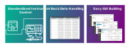

[](https://github.com/OE-FET/JISA/raw/master/JISA.jar)

<p align="center"></p>

# JISA - "LabVIEW? Never heard of her."

<p align="center"></p>

`JISA` is a library that I created, here in the Cavendish Laboratory, because I really (really really really) do not like LabVIEW. If you're ever in the mood to be forcibly bored into an early grave, ask me why. You can read all about it, as well as how to use it, on the [JISA Wiki](https://github.com/OE-FET/JISA/wiki).

In essence then, the purpose of `JISA` is to act as an alternative (and standardised) means of creating experimental control systems. Written in Java, it can be used in a variety of different languages, but works particularly well in:

- Java
- Kotlin (Used in examples below)
- Python (See [PyJISA](https://github.com/OE-FET/PyJISA))

It comprises, largely, of three sections:

1. [Standardised Instrument Control](#1-standardised-instrument-control)
2. [Data Handling](#2-data-handling)
3. [GUI Building Blocks](#3-gui-building-blocks)

### 1. Standardised Instrument Control

`JISA` implements standard interfaces for each "type" of instrument, meaning that instruments are easily interchangeable. For instance:

```kotlin
// Routine that expects a DCPower object
fun powerUp(power: DCPower) {

    power.setCurrentLimit(1.0)
    power.setVoltage(12.0)
    power.turnOn()

}

// Both AgilentE3644A and K2200 implement the DCPower interface
val power1 = AgilentE3644A(GPIBAddress(12))
val power2 = K2200(SerialAddress("COM9"))

// Thus they can both be used without altering the powerUp routine
powerUp(power1)
powerUp(power2)
```

That is, JISA ensures that no matter how the instrument functions "under the hood", its controls are always presented to you through a standard API. Furthermore, any instrument that can be thought of as being a collection of sub-instruments is treated as such, allowing further interchangeability. For instance, if we connect to a Keithley K2612B series dual-channel SMU, an Agilent SPA, and a Keithley 2450 single-channel SMU like so:

```kotlin
// Connect to instruments
val keithley = K2612B(TCPIPAddress("192.168.0.5"))
val agilent  = Agilent4155X(GPIBAddress(20))
val k2450    = K2450(USBAddress(0x05E6, 0x2450))
```

then their individual sub-instruments can be extracted as stand-alone instruments. That is, for the Keithley K2612B, its two SMU channels can be extracted as stand-alone `SMU` objects, whereas the Agilent SPA can be treated as a collection of `SMU`, `VMeter`, and `VSource` objects (representing its SMU, VMU, and VSU channels, respectively), and the Keithley 2450 is simply represented as an `SMU` object itself.

```kotlin
// Extract lists of sub-instruments
val list1 = keithley[SMU::class]    // All channels with SMU capabilities
val list2 = agilent[SMU::class]     // All channels with SMU capabilities
val list3 = agilent[VMeter::class]  // All channels with voltmeter capabilities
val list4 = agilent[VSource::class] // All channels with voltage-sourcing capabilities

// To extract just the first (i.e., index 0) SMU sub-instruments in each
val smu1 = keithley[SMU::class, 0]
val smu2 = agilent[SMU::class, 0]

// Keithley 2450 is just an SMU object (no sub-instruments)
val smu3 = k2450
```

Therefore, if we have a measurement routine that expects a single `SMU`, then it can be run on any of these instruments without changing the routine itself:

```kotlin
data class IVPoint(val V: Double, val I: Double)

// Write a method to be given an SMU channel without having to specify what make/model
fun voltageSweep(smu: SMU): List<IVPoint> {

    // Create list to hold results
    val results = ArrayList<IVPoint>()

    smu.setIntegrationTime(0.1) // Set the integration time
    smu.useAutoRanges()         // Use auto ranging on current and voltage
    smu.setVoltage(0.0)         // Set to source 0.0 V
    smu.turnOn()                // Enable output of channel
    
    // Sweep voltage from 0V to 50V, recording measured currents in list
    for (voltage in Range.linear(0, 50)) {
    
        smu.setVoltage(voltage)
        
        val current  = smu.getCurrent()
        results     += IVPoint(voltage, current)
        
    }
    
    return results

}

// Can pass any SMU to it and it will run without needing to be changed
val results1 = voltageSweep(smu1)
val results2 = voltageSweep(smu2)
val results3 = voltageSweep(smu3)
```

### 2. Data Handling

JISA provides a simple means of creating tables of data which can then be directly output as CSV files:

```kotlin
// Create results storage
val V     = Column.ofDecimals("Voltage", "V")
val I     = Column.ofDecimals("Current", "A")
val T     = Column.ofDecimals("Temperature", "K")
val table = ResultList(V, I, T)

// Take 10 readings
repeat(10) {

    // Add data by specifying columns
    table.addRow { row ->
        row[I] = smu.getCurrent()
        row[T] = tc.getTemperature()
        row[V] = smu.getVoltage()
    }
    
}

// Take another 10 readings
repeat(10) {

    // Add data by providing it in column order
    table.addData(
        smu.getVoltage(), 
        smu.getCurrent(), 
        tc.getTemperature()
    )
    
}

// Easy output as CSV file
table.output("data.csv")  
```
### 3. GUI Building Blocks
```kotlin
val smu = K236(SerialAddress("COM3"))

// Create user-input panel
val params = Fields("Parameters")

// Add input fields to it
val minV = params.addDoubleField("Min V [V]", 0.0)
val maxV = params.addDoubleField("Max V [V]", 60.0)
val numV = params.addIntegerField("No. Steps", 61)

val V       = Column.ofDecimals("Voltage", "V")
val I       = Column.ofDecimals("Current", "A")
val results = ResultList(V, I)

// Create plot
val plot = Plot("Results", results)

// Add panel and plot to a grid
val grid = Grid("Main Window", params, plot)

// Add start button to toolbar
grid.addToolbarButton("Start Sweep") { // This code will run when clicked

    // Get whatever the current values in the input fields are
    val start = minV.get()
    val stop  = maxV.get()
    val steps = numV.get()

    // Loop over the range they define
    for (voltage in Range.linear(start, stop, steps)) {
        /* do measurements etc */
    }
    
}

// Show the grid in a window
grid.show()
```
<p align="center"></p>


## JISA the Polyglot
`JISA`  is written in Java, but because Java is all about magic beans, you can actually use it in almost any language. More specifically, any language that can either be compiled to java byte-code or interpreted by a Java program (so basically anything) can use the library.

For example, here's the same program written in Java, Kotlin, Python and even gosh-darn MATLAB:

**Java - Classic style, robust but verbose, like a northern grandparent.**
```java
import jisa.devices.smu.K2450;
import jisa.results.*;
import jisa.addresses.*;
import jisa.maths.Range;
import jisa.Util;

public class Main {

    public static void main(String[] args) throws Exception {

        SMU            smu     = new K2450(new GPIBAddress(0, 20));
        Column<Double> V       = Column.ofDoubles("Voltage", "V");
        Column<Double> I       = Column.ofDoubles("Current", "A");
        ResultTable    results = new ResultList(V, I);

        smu.setVoltage(0.0);
        smu.turnOn();

        for (double v : Range.linear(0, 60, 61)) {

            smu.setVoltage(v);
            Util.sleep(500);

            results.addRow(row -> {
                row.set(V, smu.getVoltage());
                row.set(I, smu.getCurrent());
            });

        }

        smu.turnOff();
        results.output("data.csv");

    }

}
```
**Kotlin - Slick, simplified and concise without rocking the boat**
```kotlin
import jisa.devices.smu.K2450
import jisa.results.*
import jisa.addresses.*
import jisa.maths.Range
import jisa.Util

fun main() {

    val smu     = K2450(GPIBAddress(0,20))
    val V       = Column.ofDoubles("Voltage", "V")
    val I       = Column.ofDoubles("Current", "A")
    val results = ResultList(V, I)

    smu.voltage = 0.0
    smu.turnOn()

    for (v in Range.linear(0.0, 60.0, 61)) {
    
        smu.voltage = v
        Util.sleep(500)

        results.mapRow(
            V to smu.voltage,
            I to smu.current
        )
        
    }
    
    smu.turnOff()
    results.output("data.csv")

}
```
**Python - "Screw your traditions, I'm a snake from the early 1990s"**

To use in regular Python, take a look at PyJISA [here](https://github.com/OE-FET/PyJISA).
Otherwise, take a look at GraalPy [here](https://www.graalvm.org/python/).

```python
# Import and start PyJISA
import pyjisa.autoload

# Import JISA classes as if they're Python classes
from jisa.devices.smu import K2450
from jisa.addresses import GPIBAddress
from jisa.results import Column, ResultList
from jisa.maths import Range
from jisa import Util

def main():
    
    smu     = K2450(GPIBAddress(0,20))
    V       = Column.ofDoubles("Voltage", "V")
    I       = Column.ofDoubles("Current", "A")
    results = ResultList(V, I)
    
    smu.setVoltage(0.0)
    smu.turnOn()
    
    for v in Range.linear(0.0, 60.0, 61):
        
        smu.setVoltage(v)
        Util.sleep(500)
        
        results.mapRow({
            V: smu.getVoltage(),
            I: smu.getCurrent()
        })


    smu.turnOff()
    results.output("data.csv")


main()
```
**MATLAB - Why?**
```matlab
function main()
    
    smu     = jisa.devices.K2450(JISA.Addresses.GPIBAddress(0,20));
    V       = jisa.results.Column.ofDoubles("Voltage", "V");
    I       = jisa.results.Column.ofDoubles("Current", "I");
    results = jisa.results.ResultList({V, I});

    smu.setVoltage(0.0);
    smu.turnOn();
    
    for v=jisa.maths.Range.linear(0.0, 60.0, 61)
    
        smu.setVoltage(v);
        jisa.Util.sleep(500);
        results.addData([smu.getVoltage(), smu.getCurrent()]);
        
    end
    
    smu.turnOff();
    results.output('data.csv');
    
end
```
We can then extend this program easily, with only two lines, to display a plot of the results as they come in. Taking the example in Kotlin:
```kotlin
fun main() {

    val smu     = K2450(GPIBAddress(0,20))
    val V       = Column.ofDoubles("Voltage", "V")
    val I       = Column.ofDoubles("Current", "A")
    val results = ResultList(V, I)

    // Make a plot that watches our results
    val plot = Plot("Results", results)
    plot.show()

    smu.setVoltage(0.0)
    smu.turnOn()

    for (v in Range.linear(0.0, 60.0, 61)) {
    
        smu.voltage = v
        Util.sleep(500)

        results.mapRow(
            V to smu.voltage,
            I to smu.current
        )
        
    }
    
    smu.turnOff()
    results.output("data.csv")

}
```
Resulting in:

<p align="center"></p>

## Supported Instruments 

**Some of our currently implemented devices** (the list is a bit too long to put here):

> Spectrometers have relatively limited support to trigger scans as part of wider routines, we plan to improve this in the future.

| [](<>)                 | Model        | Type                         | Class              |
| ---------------------- | ------------ | ---------------------------- | ------------------ |
| **Keithley**           | 236          | SMU (Single-Channel)         | `K236`             |
| [](<>)                 | 2400 Series  | SMU (Single-Channel)         | `K2400`            |
| [](<>)                 | 2450         | SMU (Single-Channel)         | `K2450`            |
| [](<>)                 | 2600B Series | SMU (Multi-Channel)          | `K2600B`           |
| [](<>)                 | 6430         | SMU (Single-Channel)         | `K6430`            |
| [](<>)                 | 2200         | DC Power Supply              | `K2200`            |
| [](<>)                 | 2182         | Voltmeter                    | `K2182`            |
| **Agilent / Keysight** | 4155B/C      | SPA / SMU (Multi-Channel)    | `Agilent4155X`     |
| [](<>)                 | 4156B/C      | SPA / SMU (Multi-Channel)    | `Agilent4156X`     |
| [](<>)                 | B1500A       | SPA / SMU (Multi-Channel)    | `AgilentB1500A`    |
| [](<>)                 | E3644A       | DC Power Supply              | `AgilentE3644A`    |
| [](<>)                 | Cary6000i    | Spectrometer                 | `AgilentCary6000i` |
| **AIM-TTI**            | TSX3510P     | DC Power Supply              | `TSX3510P`         |
| **OI / Mercury**       | ITC-503      | Temperature Controller       | `ITC503`           |
| [](<>)                 | IPS-120      | Magnet Controller            | `IPS120`           |
| [](<>)                 | ILM-200      | He Level Meter               | `ILM200`           |
| [](<>)                 | MercuryITC   | Temperature Controller       | `MercuryITC`       |
| **Lake Shore**         | 336          | Temperature Controller       | `LS336`            |
| **Lake Shore**         | 331          | Temperature Controller       | `LS331`            |
| **CryoCon**            | 22C          | Temperature Controller       | `CryoCon22C`       |
| **Stanford Research**  | SR830        | Dual-Phase Lock-In Amplifier | `SR830`            |
| [](<>)                 | SR560        | Voltage Pre-Amp              | `SR560`            |
| **Eurotherm**          | 2408         | Temperature Controller       | `ET2408`           |
| **Pico Technology**    | USB-TC08     | Thermometer (Multi-Channel)  | `USBTC08`          |
| **Arroyo**             | TEC          | Temperature Controller       | `ArroyoTEC`        |
| **Bruker**             | 70v          | Spectrometer                 | `Bruker70v`        |
| **Pegasus**            | Pegasus      | Translation Stage / Prober   | `Pegasus`          |


## Prerequisites

Before being able to use JISA, you will need the Java Development Kit (JDK) 11 or newer installed.

### Linux

Either you'll already have OpenJDK installed or you simply need to run something like:

```
sudo apt install openjdk-11-jdk
```

### Windows and MacOS X

You can download pre-built OpenJDK packages (with installers) from the Adoptium (previously known as "Adopt OpenJDK") website:

[https://adoptium.net/en-GB/temurin/releases/?version=11&package=jdk&os=any&arch=x64](https://adoptium.net/en-GB/temurin/releases/?version=11&package=jdk&os=any&arch=x64)

## Using JISA

You can use JISA in your project simply by including the JISA.jar file as a library. This will work so-long as your project uses Java 11 or newer.

<p align="center">

[](https://github.com/OE-FET/JISA/raw/master/JISA.jar)

</p>

If using IntelliJ IDEA, this means adding JISA.jar to your project directory and, inside IDEA, right-clicking on it then selecting "Add as Library..."
